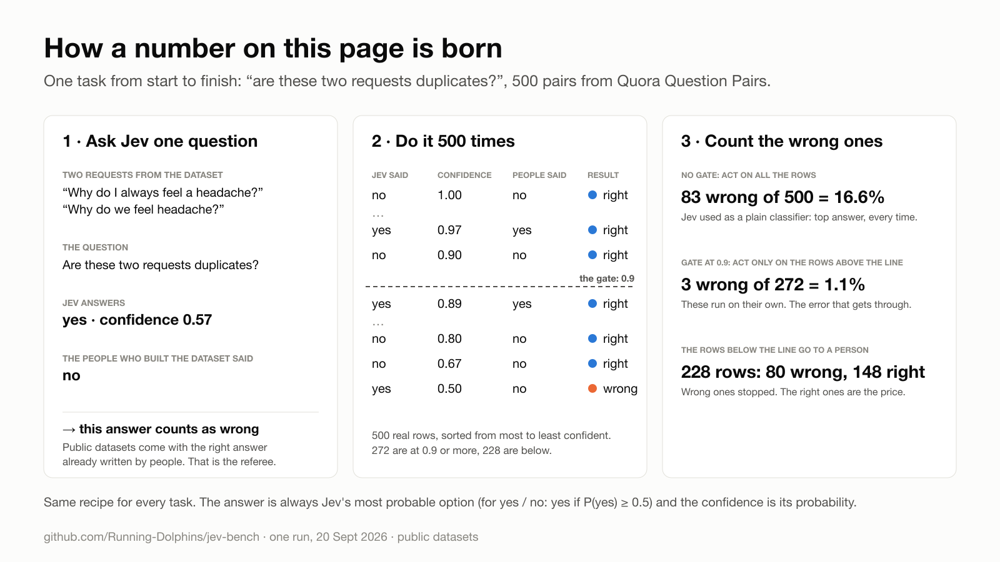
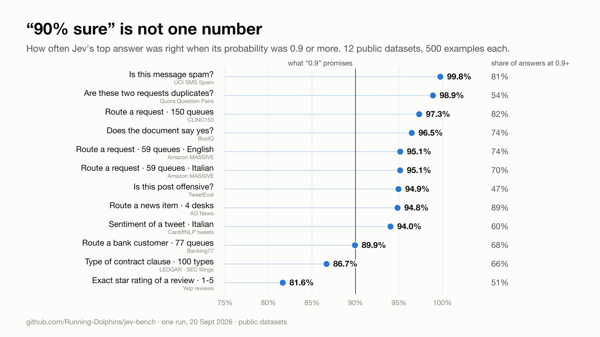
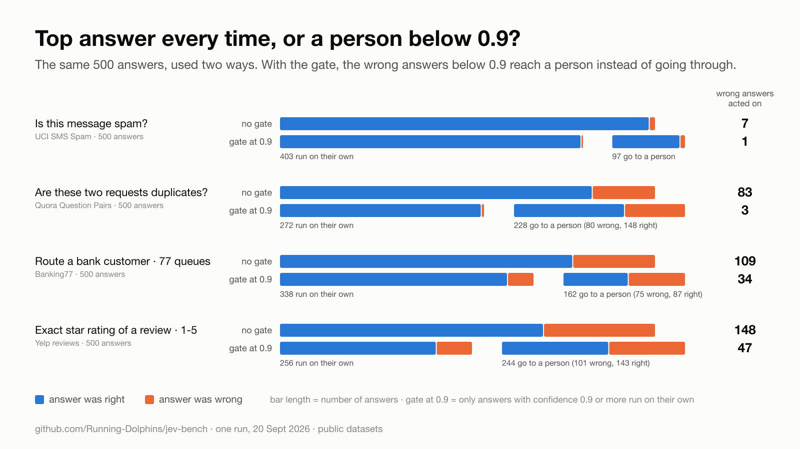
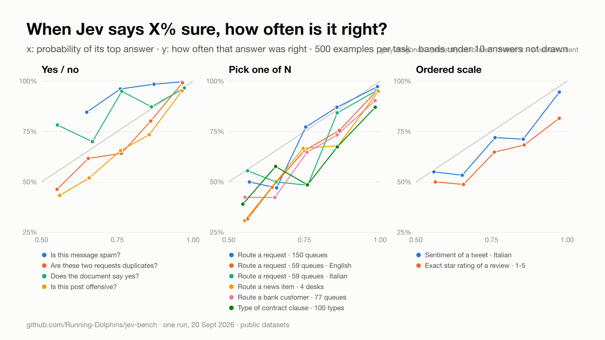
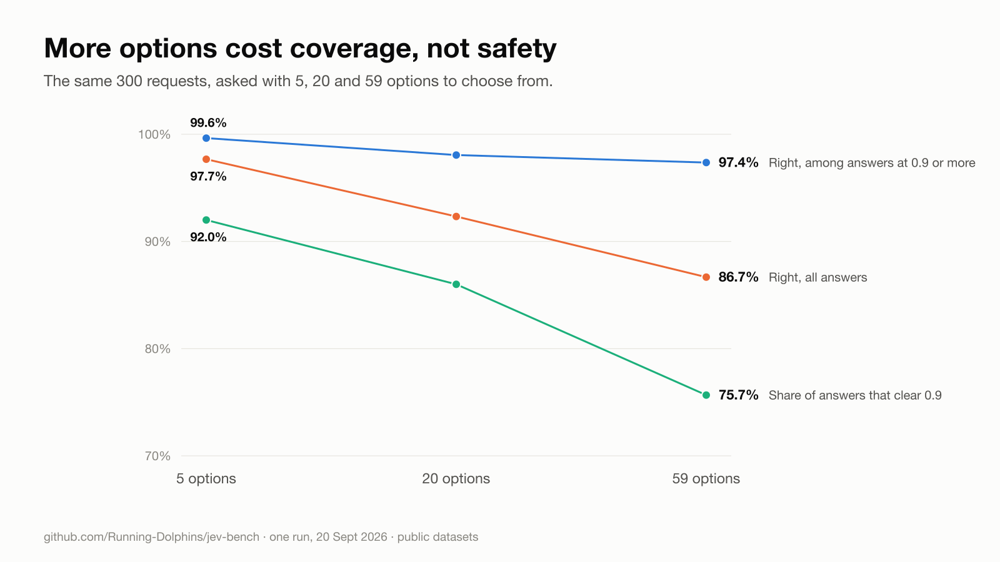
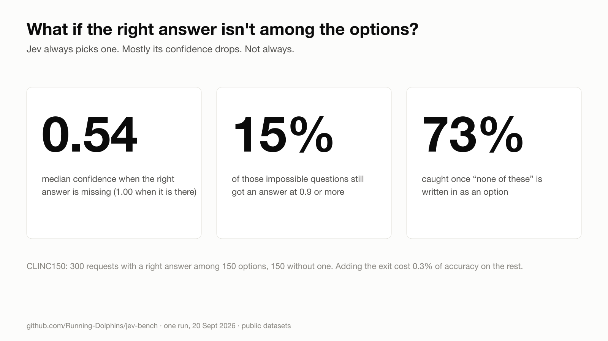

# jev-bench

Measure **accuracy and calibration** of [Jev](https://typesafe.ai) (TypeSafe AI's decision model) on public datasets, on tasks that look like the decisions a business actually automates: route this message, is this a duplicate, is this spam, what kind of clause is this, how unhappy is this customer.

One Python file, standard library only, no dataset to download by hand. A full run of all twelve tasks at 500 examples each costs a few cents.

> Not affiliated with TypeSafe AI. Built by [Running Dolphins](https://runningdolphins.com) because at launch nobody outside TypeSafe had published a calibration measurement, and the confidence number is the whole point of the model.

## Why calibration, not just accuracy

Jev doesn't write text. You give it some state and a closed question, and it returns probabilities plus a confidence number. That number is what makes a decision automatable: above a threshold the step runs on its own, below it a person looks.

That is the pattern this repo is about: **Jev as the gate of a human-in-the-loop process.** Every classification comes with a number; above your threshold the step runs on its own, below it a person decides. On 500 "is this a duplicate?" decisions, acting on every answer let 83 wrong ones through; with a person below 0.9, 3 ([how that is counted](#how-every-number-is-produced)).

A text-generating LLM gives you the answer without the doubt. You can ask it to state a confidence, or read token log-probabilities where the API exposes them, but neither is designed as a calibrated probability over your options, and stated confidences are known to cluster high. We did not measure an LLM here, so this is the motivation, not a result: what we measured is whether Jev's own number is good enough to be that gate.

That only works if the number means what it says. **If the model says 0.9, is it right 9 times out of 10?** Accuracy can't answer that. A reliability table can:

```
banking77 · reliability — stated confidence vs actual accuracy
  0.5-0.6  n=33    stated 0.55  actual 0.42  over-confident
  0.6-0.7  n=26    stated 0.65  actual 0.42  over-confident
  0.8-0.9  n=45    stated 0.86  actual 0.73  over-confident
  0.9-1.0  n=333   stated 0.98  actual 0.90  over-confident
```

Read it as: "of the answers where Jev claimed 80-90%, 73% were right". On a different task (`sms-spam`) the same band is right 99% of the time: the model is *under*-confident there. Same model, same band, opposite behaviour. That gap, per band, is what tells you where to put your threshold.

## How every number is produced



1. Take **500 random examples** (fixed seed) from a public, labelled dataset. Which one, per task: see [Tasks](#tasks).
2. For each example make **one API call** with one closed question. Jev has three question types: `choice` (pick one of N options), `noul` (yes / no) and `score` (an ordered scale).
3. Jev returns a probability for every option. **The answer is the most probable option** (for yes / no: "yes" if P(yes) is 0.5 or more). **Its probability is what this page calls "confidence".**
4. Compare the answer with the dataset's label: right or wrong.

Every table and chart here is those 500 pairs (confidence, right or wrong) cut a different way. The **gate** is the rule a process would use: answers at 0.9 or more run on their own, the rest go to a person. 0.9 was fixed before looking at the data and is the same everywhere.

One thing to know if you use Jev: for `choice` and `score` the API also returns a separate `confidence` field. We measure the top probability instead because it exists for all three types (`noul` has no such field). On intent routing the two differ by 0.03 at most; on `sentiment-it` and `yelp-stars` they can differ a lot (up to 0.64 and 0.26). `results/*.json` reports the calibration error of both.

## How to read the charts

Two questions decide whether the confidence is useful, and each chart answers one of them.

**1. Does the number mean what it says?** (*calibration* — the reliability chart.) Take all the answers where Jev said "about 80% sure" and count how many were right. If 80% were, the number is honest. On the chart, x is what Jev claimed and y is what actually happened; the grey diagonal is a model whose claims are exactly true. A line **below** the diagonal is over-confident (claims 0.85, right 70% of the time). **Above** it is under-confident.

**2. Does the number separate right answers from wrong ones?** (*ranking* — the gate chart and the curve in [RESULTS.md](RESULTS.md#with-and-without-the-gate).) If the confidence is informative, the wrong answers pile up below the gate and the right ones above it. If it were noise, the answers below the gate would be as good as the ones above, and holding them back would buy you nothing.

The two are independent. A number can be badly calibrated and still rank well: then you can't read 0.8 as "80%", but you can still find, on your own data, the cut-off above which errors are rare. That is the practical use.

## What we saw (one run, 20 September 2026)

Observations, not laws. Under each one: where it comes from. Percentages on a few hundred answers carry a 95% interval of roughly ±2 to ±5 points; [RESULTS.md](RESULTS.md) has the intervals.



- **"0.9" is not one number.** Among the answers at 0.9 or more, Jev was right 99.8% of the time on spam, 98.9% on duplicates, 95-97% on intent routing, 86.7% on contract clauses and 81.6% on exact star ratings. The intervals of the top and the bottom do not overlap (spam 98.6-100%, stars 76-86%). The threshold has to be set per task.
  <br>*Source: all 12 tasks, 500 examples each → RESULTS § Tasks.*
- **Used as a gate with a person behind it, the confidence cuts the errors that get through.** Take `duplicates`. Use Jev like a plain classifier, top answer every time, and 83 of 500 answers are wrong (16.6%). Put it in a process with a human in the loop instead: answers at 0.9 or more run on their own, the rest go to a person. Now 272 run on their own and 3 of them are wrong (1.1%); the other 80 errors landed on the person's desk. Across the twelve tasks the error rate without a gate ran from 1.4% (spam) to 29.6% (exact stars), and with it from 0.2% to 18.4%.
  <br>*Source: all 12 tasks → RESULTS § With and without the gate*
- **The gate has a price, and it is task-specific.** On `duplicates`, 148 of the 228 answers sent to a person were right: you pay 35% of the right answers to stop 96% of the wrong ones. On `yelp-stars` you pay 41% and still let 18% errors through: there the task is too hard for the confidence to rescue it. Across tasks the price ran from 7% to 41%.
  <br>*Source: same table, columns "Errors the gate stops" and "Right answers held back".*



- **Low confidence is a real warning.** Among the answers below 0.7 (where Jev claimed about 0.55-0.60) it was right 37-56% of the time on ten tasks out of twelve, on 20 to 109 answers per task. The two exceptions were `doc-yesno` (35 right of 48) and `sms-spam` (14 of 18), too few answers to say more than "not over-confident there".
  <br>*Source: all 12 tasks → same table, column "Right when confidence < 0.7".*
- **Between 0.7 and 0.9 the number meant different things on different tasks.** In the 0.8-0.9 band Jev claimed about 0.85 and was right 99% of the time on `sms-spam` (67 answers), 80% on `duplicates` (81), 73% on `offensive` (98) and on `banking77` (45), 68% on `yelp-stars` (79). It does not split cleanly by question type. It is a property of the task, the dataset and the prompt together, which is the argument for measuring yours.
  <br>*Source: all 12 tasks → RESULTS § Reliability.*



- **More options cost coverage first.** Same requests with 5 / 20 / 59 options to choose from: accuracy 97.7% → 92.3% → 86.7%, and the share of answers that clear 0.9 fell 92% → 86% → 76%. Above 0.9 the errors went from 1 of 276 to 5 of 258 to 6 of 227: a small drift, within the noise at this sample size. The extra options were random, which is the easy case; queues that resemble each other will cost more.
  <br>*Source: experiment `options`, Amazon MASSIVE (EN), the same 300 requests → RESULTS § options.*



- **No measurable cost for Italian, on short requests.** Same 300 requests in English and Italian: 87.0% and 87.0%, ten errors unique to each side, 97.8% vs 98.1% above 0.9. With 300 examples a gap under about 4 points would not show. These are one-line voice-assistant commands, translated; long Italian business documents were not tested.
  <br>*Source: experiment `language`, Amazon MASSIVE parallel corpus → RESULTS § language.*
- **When the right answer is missing, the confidence mostly says so, but not always.** Out-of-scope requests got a median top probability of 0.54 against 1.00 for in-scope ones (AUROC 0.91), yet 15% of them still came back at 0.9 or more. Adding an explicit "none of these" option caught 73% of them and cost 0.3 points of in-scope accuracy.
  <br>*Source: experiment `oos`, CLINC150, 300 in-scope and 150 out-of-scope requests → RESULTS § oos.*



- **Instability lives where confidence is low.** Shuffling the order of 77 options changed the answer on 8.7% of the requests, and on none of the 194 that were at 0.9 or more in the first order (so under 2%, at 95%). The same request sent five times changed answer 3% of the time and crossed the 0.9 line 4.7% of the time: a gate at 0.9 is not perfectly deterministic near the line.
  <br>*Source: experiments `order` and `repeat`, Banking77, 300 requests → RESULTS § order, § repeat; the 194 is counted from `predictions/x-order.jsonl`.*
- **On an ordered scale, wrong means slightly wrong.** Star ratings: 70.4% exact, 99.6% within one star, and no error of two stars or more above 0.9.
  <br>*Source: task `yelp-stars`, 500 Yelp reviews → `predictions/yelp-stars.jsonl`.*
- **One line of description per option did not help** on a 4-option task (93.3% bare labels, 92.7% described). A null result on one easy task, nothing more.
  <br>*Source: experiment `descriptions`, AG News, 300 items → RESULTS § descriptions.*
- **Latency was flat** at about 0.9 s from Italy for every task, against the 70-500 ms on the product page. Cost ran from $0.014 to $0.10 per thousand decisions, driven by how many options you list.
  <br>*Source: all 12 tasks → RESULTS § Tasks.*

## Limits

- **One run, 500 examples per task, 300 per experiment.** Differences of a few points between tasks are inside the noise. Bands with a dozen answers say almost nothing.
- **"Wrong" means "disagrees with the dataset's label".** Public datasets have label errors, and there are wrong answers even at probability 1.00 (11 of 191 on `banking77`, 14 of 187 on `ledgar`). We did not check how many of those are the dataset's fault. Label noise lowers measured accuracy and makes calibration look worse than it is.
- **The datasets are public and old.** Jev may have seen them in training; we cannot check. If so, the numbers here are optimistic compared with your private data.
- **One prompt per task,** some with a description for each option and some with bare labels. A different wording can move the numbers, so a difference between two tasks is a difference between two task-dataset-prompt bundles.
- **0.9 is an example, not a recommendation.** The point of the exercise is that the right threshold is per task.

## Quick start

```bash
git clone https://github.com/Running-Dolphins/jev-bench.git && cd jev-bench
cp .env.example .env          # paste your TypeSafe API key
python3 jevbench.py list
python3 jevbench.py run sms-spam --n 200
python3 jevbench.py run all --n 500
python3 jevbench.py experiment all --n 300
python3 jevbench.py report    # rebuilds RESULTS.md
```

`--dry-run` makes no API calls (fake answers) and is there to test the code.

## Tasks

500 random examples each (fixed seed), from the test or validation split of a public dataset. The question is the one sent to Jev, word for word; the options are the dataset's own label names unless noted.

| Task | Dataset | Question sent to Jev | Type | Stands for |
|---|---|---|---|---|
| `banking77` | PolyAI Banking77 · EN | "Which banking support intent does this customer message express?" | choice · 77 options | route a customer message, many queues |
| `clinc150` | CLINC150 · EN | "Which intent does this user request express?" | choice · 150 options | same, with very many intents |
| `massive-en` / `massive-it` | Amazon MASSIVE · EN / IT, same requests | "Which intent does this voice-assistant request express?" (in Italian for `-it`) | choice · 59 options | same requests in two languages |
| `ledgar` | LEDGAR (LexGLUE), clauses from SEC filings · EN | "What type of contract clause is this?" | choice · 100 options | classify a contract clause |
| `ag-news` | AG News · EN | "Which desk should this news item be routed to?" · one line of description per option | choice · 4 options | coarse routing, few options |
| `sms-spam` | UCI SMS Spam Collection · EN | "Is this text message spam?" · with a description of yes and no | noul (yes / no) | filter junk before it reaches a person |
| `duplicates` | Quora Question Pairs (GLUE) · EN | "Are these two requests duplicates, i.e. would the same answer fully resolve both?" | noul | is this ticket a duplicate of that one |
| `doc-yesno` | BoolQ · EN | "According to the document, is the answer to the question yes?" | noul | policy checks against a document |
| `offensive` | TweetEval, offensive · EN | "Is this post offensive (insults, slurs, targeted attacks, profanity aimed at someone)?" | noul | content moderation |
| `yelp-stars` | Yelp reviews · EN | "How many stars did the customer give in this review?" | score · 5 ordered levels | how satisfied is this customer |
| `sentiment-it` | CardiffNLP multilingual tweets · IT | "Qual è il sentimento espresso da questo tweet?" | score · 3 levels | sentiment, in Italian |

With 500 examples and 150 intents, `clinc150` sees 87 of the intents as the right answer; all 150 are always offered as options. Likewise 89 of 100 for `ledgar` and 56 of 59 for MASSIVE.

## Experiments

Accuracy on a benchmark is the least interesting thing you can measure. These are the questions that decide whether you can put the model in a process:

| Experiment | Question |
|---|---|
| `oos` | The right answer is **not among the options**. Does the confidence drop, or does it pick something at 0.9? And if you add a "none of these" option, does it use it? |
| `language` | Same requests in English and Italian. How much do you lose? |
| `options` | Same examples with 5, 20, 59 options. What does each extra option cost? |
| `order` | Same options, shuffled. Does the answer change? Does it change above 0.9? |
| `repeat` | Same request five times. How much does the number move on its own, and how often does it cross your threshold? |
| `descriptions` | Bare label names vs one line of description per option. |

## Results

Ours are in [RESULTS.md](RESULTS.md), with date and sample size. **They are measurements on these datasets, with these prompts, on one day.** Public datasets have noisy labels, which lowers measured accuracy and makes calibration look worse than it is. Treat every number as an example of what you can measure, not as a property of the model. The useful move is to run the same table on a few hundred of *your* labelled examples:

```python
# your_task.py — add a task in ten lines
from jevbench import run_examples, summarize, show, load_env
load_env()
examples = [{"state": "text of the email…", "label": "billing"}, ...]   # label = the truth
question = {"type": "choice", "instructions": "Which team should handle this email?",
            "criteria": {"billing": "invoices, charges, refunds", "tech": "bugs, access", "sales": "quotes, upgrades"}}
show(summarize("my-inbox", run_examples(examples, question)))
```

## What is in the repo, and what is not

- `figures/` — the charts on this page, drawn from `results/` and `predictions/` by `figures/make_figures.py` (standard library; PNG export needs `rsvg-convert`).
- `results/*.json` — aggregates (accuracy, ECE, thresholds, reliability table). Committed.
- `predictions/*.jsonl` — every single prediction of our run (label, answer, top probability, confidence field, latency, tokens), **without the dataset text** (the only dataset text in the repo is the one pair of questions shown in `figures/method.png`). Committed: you can recompute every table, or cut the data your own way, without calling the API.
- `raw/` — per-example outputs with the input text. **Git-ignored**: they contain dataset text, and yours may contain your data.
- `data/` — dataset cache. Git-ignored. Datasets are fetched from their public sources (Hugging Face datasets-server, PolyAI's GitHub); check each dataset's licence before reusing the data itself.
- `.env` — your key. Git-ignored.

## Licence

MIT.
