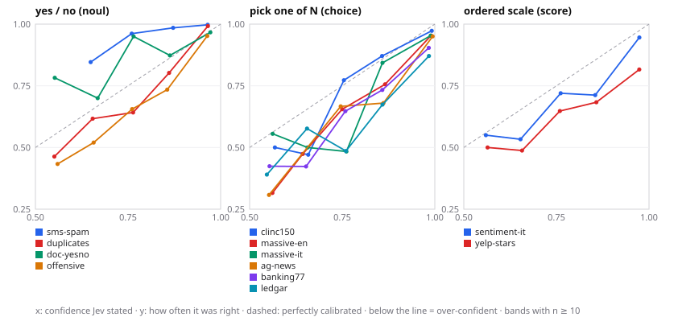

# Results

Model `jev-latest`, run on 2026-09-20. One run per task, random sample with a fixed seed. Measurements on *these* datasets with *these* prompts: examples of what you can measure, not properties of the model.

## Tasks

Sorted by accuracy above the 0.9 line.

| Task | Type | n | Accuracy | ECE | Coverage ≥0.9 | Accuracy ≥0.9 | Median latency | $ / 1,000 |
|---|---|---|---|---|---|---|---|---|
| `sms-spam` | noul | 500 | 98.6% | 0.058 | 80.6% | **99.8%** | 0.90 s | 0.0140 |
| `duplicates` | noul | 500 | 83.4% | 0.051 | 54.4% | **98.9%** | 0.90 s | 0.0137 |
| `clinc150` | choice · 150 options | 500 | 91.4% | 0.028 | 82.2% | **97.3%** | 0.93 s | 0.1045 |
| `doc-yesno` | noul | 500 | 93.0% | 0.026 | 73.6% | **96.5%** | 0.89 s | 0.0179 |
| `massive-en` | choice · 60 options | 500 | 84.4% | 0.061 | 74.0% | **95.1%** | 0.89 s | 0.0522 |
| `massive-it` | choice · 60 options | 500 | 83.6% | 0.057 | 69.8% | **95.1%** | 0.90 s | 0.0525 |
| `offensive` | noul | 500 | 76.6% | 0.072 | 47.4% | **94.9%** | 0.89 s | 0.0137 |
| `ag-news` | choice · 4 options | 500 | 91.0% | 0.057 | 89.0% | **94.8%** | 0.93 s | 0.0175 |
| `sentiment-it` | score · 3 levels | 500 | 82.4% | 0.054 | 60.2% | **94.0%** | 0.88 s | 0.0156 |
| `banking77` | choice · 77 options | 500 | 78.2% | 0.099 | 67.6% | **89.9%** | 0.91 s | 0.0709 |
| `ledgar` | choice · 100 options | 500 | 74.0% | 0.138 | 66.0% | **86.7%** | 0.89 s | 0.0845 |
| `yelp-stars` | score · 5 levels | 500 | 70.4% | 0.147 | 51.2% | **81.6%** | 0.89 s | 0.0220 |

## Reliability: stated confidence vs actual accuracy

Each cell: how often Jev was right among the answers whose top probability fell in that band (n in brackets). A calibrated model shows ~0.55 under 0.5-0.6 and ~0.95 under 0.9-1.0.

| Task | 0.5-0.6 | 0.6-0.7 | 0.7-0.8 | 0.8-0.9 | 0.9-1.0 |
|---|---|---|---|---|---|
| `sms-spam` | 0.71 (7) | 0.85 (13) | 0.96 (26) | 0.99 (67) | 1.00 (387) |
| `duplicates` | 0.46 (41) | 0.62 (47) | 0.64 (67) | 0.80 (81) | 0.99 (261) |
| `clinc150` | 0.50 (12) | 0.47 (17) | 0.77 (22) | 0.87 (31) | 0.97 (407) |
| `doc-yesno` | 0.78 (23) | 0.70 (30) | 0.95 (20) | 0.87 (63) | 0.97 (363) |
| `massive-en` | 0.32 (19) | 0.47 (19) | 0.66 (29) | 0.76 (41) | 0.95 (365) |
| `massive-it` | 0.56 (18) | 0.50 (24) | 0.48 (31) | 0.84 (51) | 0.95 (344) |
| `offensive` | 0.43 (60) | 0.52 (50) | 0.66 (61) | 0.73 (98) | 0.95 (230) |
| `ag-news` | 0.31 (13) | 0.71 (7) | 0.67 (12) | 0.68 (25) | 0.95 (443) |
| `sentiment-it` | 0.55 (40) | 0.53 (30) | 0.72 (50) | 0.71 (73) | 0.95 (295) |
| `banking77` | 0.42 (33) | 0.42 (26) | 0.65 (34) | 0.73 (45) | 0.90 (333) |
| `ledgar` | 0.39 (41) | 0.58 (26) | 0.49 (35) | 0.67 (46) | 0.87 (325) |
| `yelp-stars` | 0.50 (48) | 0.49 (41) | 0.65 (71) | 0.68 (79) | 0.82 (250) |

## Experiments

### `oos` — The right answer is not among the options: does the confidence tell you?

CLINC150, 300 in-scope and 150 out-of-scope requests.

| Without a "none of these" option | |
|---|---|
| Median top probability, in-scope requests | 1.00 |
| Median top probability, out-of-scope requests | 0.54 |
| Top probability separates the two (AUROC) | 0.91 |
| Out-of-scope requests answered at ≥ 0.9 anyway | 15.3% |
| Out-of-scope requests answered at ≥ 0.7 anyway | 33.3% |

| With the option added | |
|---|---|
| Out-of-scope requests caught | 72.7% |
| In-scope requests wrongly sent to the exit | 1.7% |
| In-scope accuracy, before → after | 93.0% → 92.7% |

### `language` — Same requests in English and Italian (parallel corpus)

MASSIVE, the same 300 requests.

| | Accuracy | ECE | Coverage ≥0.9 | Accuracy ≥0.9 |
|---|---|---|---|---|
| English | 87.0% | 0.052 | 75.0% | 97.8% |
| Italian | 87.0% | 0.035 | 71.0% | 98.1% |
| Italian text, English instructions | 85.7% | 0.039 | 70.0% | 97.6% |

Both right: 251 · only English right: 10 · only Italian right: 10.

### `options` — Same examples with 5, 20 and 59 options

MASSIVE (EN), the same 300 requests; the right option plus random distractors.

| Options | Accuracy | ECE | Coverage ≥0.9 | Accuracy ≥0.9 | $ / 1,000 |
|---|---|---|---|---|---|
| 5 | 97.7% | 0.017 | 92.0% | 99.6% | 0.0157 |
| 20 | 92.3% | 0.031 | 86.0% | 98.1% | 0.0258 |
| 59 | 86.7% | 0.060 | 75.7% | 97.4% | 0.0522 |

### `order` — Same options in a different order: does the answer move?

Banking77, 300 requests, 77 options in three random orders.

| | |
|---|---|
| Accuracy in each order | 76.7% · 77.0% · 77.7% |
| Requests whose answer changed with the order | 8.7% |
| Mean top probability when the answer is stable / when it flips | 0.90 / 0.58 |
| Requests at ≥ 0.9 in all three orders | 59.7% |
| …of which changed answer | 0 |

### `repeat` — Same request five times: how stable is the number?

Banking77, 300 requests, each sent 5 times unchanged.

| | |
|---|---|
| Spread of the top probability across repeats, median / 95th percentile | 0.01 / 0.09 |
| Requests whose answer changed between repeats | 3.0% |
| Requests that crossed the 0.9 line between repeats | 4.7% |

### `descriptions` — Bare labels vs one line of description per option

AG News, 300 items, 4 options.

| Criteria | Accuracy | ECE | Coverage ≥0.9 | Accuracy ≥0.9 |
|---|---|---|---|---|
| Label names only | 93.3% | 0.036 | 85.3% | 96.9% |
| One line of description each | 92.7% | 0.046 | 87.7% | 96.2% |

