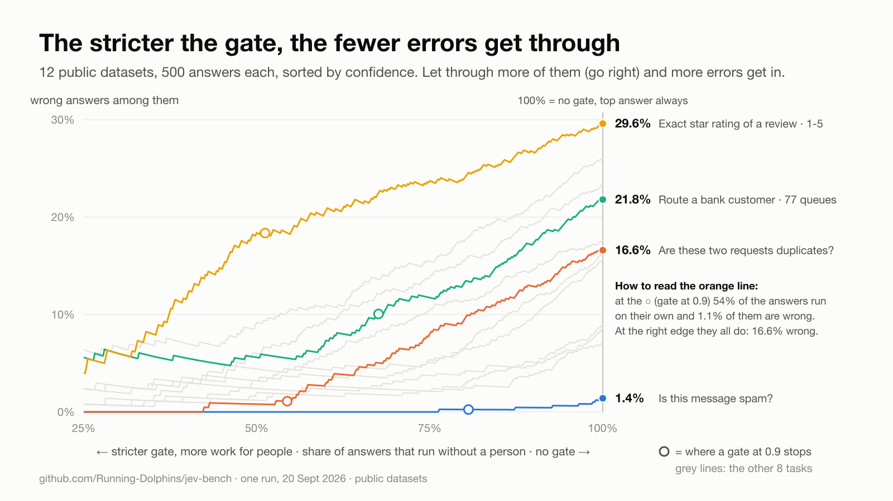

# Results

Model `jev-latest`, run on 2026-09-20. One run per task, random sample with a fixed seed. Measurements on *these* datasets with *these* prompts: examples of what you can measure, not properties of the model.

How a number is produced, which dataset and which question each task uses, and the limits of all this: see the [README](README.md#how-every-number-is-produced). Throughout, **the answer is Jev's most probable option and "confidence" is that option's probability**; right or wrong is judged against the dataset's own label.

## Tasks

Sorted by accuracy above the 0.9 line. *Coverage ≥0.9* is the share of answers at 0.9 or more; *Accuracy ≥0.9* is how many of those were right, with its 95% interval (Wilson): with a few hundred answers the last digit is not to be trusted.

| Task | Type | n | Accuracy | ECE | Coverage ≥0.9 | Accuracy ≥0.9 | 95% interval | Median latency | $ / 1,000 |
|---|---|---|---|---|---|---|---|---|---|
| `sms-spam` | noul | 500 | 98.6% | 0.058 | 80.6% | **99.8%** | 98.6% – 100.0% | 0.90 s | 0.0140 |
| `duplicates` | noul | 500 | 83.4% | 0.051 | 54.4% | **98.9%** | 96.8% – 99.6% | 0.90 s | 0.0137 |
| `clinc150` | choice · 150 options | 500 | 91.4% | 0.028 | 82.2% | **97.3%** | 95.3% – 98.5% | 0.93 s | 0.1045 |
| `doc-yesno` | noul | 500 | 93.0% | 0.026 | 73.6% | **96.5%** | 94.1% – 97.9% | 0.89 s | 0.0179 |
| `massive-en` | choice · 59 options | 500 | 84.4% | 0.061 | 74.0% | **95.1%** | 92.4% – 96.9% | 0.89 s | 0.0522 |
| `massive-it` | choice · 59 options | 500 | 83.6% | 0.057 | 69.8% | **95.1%** | 92.3% – 96.9% | 0.90 s | 0.0525 |
| `offensive` | noul | 500 | 76.6% | 0.072 | 47.4% | **94.9%** | 91.4% – 97.1% | 0.89 s | 0.0137 |
| `ag-news` | choice · 4 options | 500 | 91.0% | 0.057 | 89.0% | **94.8%** | 92.4% – 96.5% | 0.93 s | 0.0175 |
| `sentiment-it` | score · 3 levels | 500 | 82.4% | 0.054 | 60.2% | **94.0%** | 90.7% – 96.2% | 0.88 s | 0.0156 |
| `banking77` | choice · 77 options | 500 | 78.2% | 0.099 | 67.6% | **89.9%** | 86.3% – 92.7% | 0.91 s | 0.0709 |
| `ledgar` | choice · 100 options | 500 | 74.0% | 0.138 | 66.0% | **86.7%** | 82.6% – 89.9% | 0.89 s | 0.0845 |
| `yelp-stars` | score · 5 levels | 500 | 70.4% | 0.147 | 51.2% | **81.6%** | 76.4% – 85.9% | 0.89 s | 0.0220 |

## With and without the gate

One row per task, 500 answers each. Two ways to use Jev are compared. **Ignore the confidence**: take the most probable answer every time and act on all 500. **Gate at 0.9**: act only on the answers whose probability is 0.9 or more, send the rest to a person.

Worked example, `duplicates` (500 pairs from Quora Question Pairs): ignoring the confidence, 83 answers of 500 are wrong (16.6%). With the gate, 272 answers run on their own and 3 of them are wrong (1.1%): the gate stopped 80 of the 83 errors (96.4%). The price: of the 228 answers sent to a person, 148 were right, which is 35.5% of all the right answers.

Columns: *Wrong if you ignore it* = error rate on all 500 · *Wrong above 0.9* = error rate among the answers the gate lets through · *Errors the gate stops* = share of all errors that fell below 0.9 · *Right answers held back* = share of all right answers that fell below 0.9 · *Right when confidence < 0.7* = accuracy among the least confident answers.

| Task | Wrong if you ignore it | Wrong above 0.9 | Errors the gate stops | Right answers held back | Right when confidence < 0.7 | AUROC |
|---|---|---|---|---|---|---|
| `yelp-stars` | 29.6% | 18.4% | 68.2% | 40.6% | 48.5% (n=99) | 0.72 |
| `ledgar` | 26.0% | 13.3% | 66.1% | 22.7% | 41.3% (n=92) | 0.79 |
| `offensive` | 23.4% | 5.1% | 89.7% | 41.2% | 45.9% (n=109) | 0.82 |
| `banking77` | 21.8% | 10.1% | 68.8% | 22.2% | 39.5% (n=86) | 0.81 |
| `sentiment-it` | 17.6% | 6.0% | 79.5% | 31.3% | 55.6% (n=81) | 0.81 |
| `duplicates` | 16.6% | 1.1% | 96.4% | 35.5% | 54.5% (n=88) | 0.86 |
| `massive-it` | 16.4% | 4.9% | 79.3% | 20.6% | 43.1% (n=72) | 0.84 |
| `massive-en` | 15.6% | 4.9% | 76.9% | 16.6% | 36.9% (n=65) | 0.85 |
| `ag-news` | 9.0% | 5.2% | 48.9% | 7.2% | 45.0% (n=20) | 0.84 |
| `clinc150` | 8.6% | 2.7% | 74.4% | 12.5% | 41.0% (n=39) | 0.87 |
| `doc-yesno` | 7.0% | 3.5% | 62.9% | 23.7% | 72.9% (n=48) | 0.79 |
| `sms-spam` | 1.4% | 0.2% | 85.7% | 18.5% | 77.8% (n=18) | 0.93 |

AUROC: the chance that a right answer carries a higher confidence than a wrong one. 0.5 means the number is noise, 1.0 means it sorts them perfectly.

The same comparison for every possible gate, not just 0.9. Answers are sorted from most to least confident; at x = 60% you act on the most confident 60% and y is the error rate among them. The hollow dot is the gate at 0.9, the right edge is no gate at all. The curves start at 25% because with fewer answers one error moves the line by whole points. Some curves do not start at zero: there are wrong answers even at probability 1.00 (11 of 191 on `banking77`, 14 of 187 on `ledgar`), and how many of those are errors in the dataset's labels we did not check.

## Reliability: stated confidence vs actual accuracy

Each cell: how often Jev was right among the answers whose top probability fell in that band (n in brackets). A calibrated model shows ~0.55 under 0.5-0.6 and ~0.95 under 0.9-1.0. Mind the n: a cell with 13 answers has a 95% interval of about ±25 points, and the chart leaves out cells with fewer than 10.

| Task | 0.5-0.6 | 0.6-0.7 | 0.7-0.8 | 0.8-0.9 | 0.9-1.0 |
|---|---|---|---|---|---|
| `sms-spam` | 0.71 (7) | 0.85 (13) | 0.96 (26) | 0.99 (67) | 1.00 (387) |
| `duplicates` | 0.46 (41) | 0.62 (47) | 0.64 (67) | 0.80 (81) | 0.99 (261) |
| `clinc150` | 0.50 (12) | 0.47 (17) | 0.77 (22) | 0.87 (31) | 0.97 (407) |
| `doc-yesno` | 0.78 (23) | 0.70 (30) | 0.95 (20) | 0.87 (63) | 0.97 (363) |
| `massive-en` | 0.32 (19) | 0.47 (19) | 0.66 (29) | 0.76 (41) | 0.95 (365) |
| `massive-it` | 0.56 (18) | 0.50 (24) | 0.48 (31) | 0.84 (51) | 0.95 (344) |
| `offensive` | 0.43 (60) | 0.52 (50) | 0.66 (61) | 0.73 (98) | 0.95 (230) |
| `ag-news` | 0.31 (13) | 0.71 (7) | 0.67 (12) | 0.68 (25) | 0.95 (443) |
| `sentiment-it` | 0.55 (40) | 0.53 (30) | 0.72 (50) | 0.71 (73) | 0.95 (295) |
| `banking77` | 0.42 (33) | 0.42 (26) | 0.65 (34) | 0.73 (45) | 0.90 (333) |
| `ledgar` | 0.39 (41) | 0.58 (26) | 0.49 (35) | 0.67 (46) | 0.87 (325) |
| `yelp-stars` | 0.50 (48) | 0.49 (41) | 0.65 (71) | 0.68 (79) | 0.82 (250) |

## Experiments

### `oos` — The right answer is not among the options: does the confidence tell you?

CLINC150, 300 in-scope and 150 out-of-scope requests.

| Without a "none of these" option | |
|---|---|
| Median top probability, in-scope requests | 1.00 |
| Median top probability, out-of-scope requests | 0.54 |
| Top probability separates the two (AUROC) | 0.91 |
| Out-of-scope requests answered at ≥ 0.9 anyway | 15.3% |
| Out-of-scope requests answered at ≥ 0.7 anyway | 33.3% |

| With the option added | |
|---|---|
| Out-of-scope requests caught | 72.7% |
| In-scope requests wrongly sent to the exit | 1.7% |
| In-scope accuracy, before → after | 93.0% → 92.7% |

### `language` — Same requests in English and Italian (parallel corpus)

MASSIVE, the same 300 requests.

| | Accuracy | ECE | Coverage ≥0.9 | Accuracy ≥0.9 |
|---|---|---|---|---|
| English | 87.0% | 0.052 | 75.0% | 97.8% |
| Italian | 87.0% | 0.035 | 71.0% | 98.1% |
| Italian text, English instructions | 85.7% | 0.039 | 70.0% | 97.6% |

Both right: 251 · only English right: 10 · only Italian right: 10.

### `options` — Same examples with 5, 20 and 59 options

MASSIVE (EN), the same 300 requests; the right option plus random distractors. Random distractors are the easy case: real queues resemble each other more.

| Options | Accuracy | ECE | Coverage ≥0.9 | Accuracy ≥0.9 | $ / 1,000 |
|---|---|---|---|---|---|
| 5 | 97.7% | 0.017 | 92.0% | 99.6% | 0.0157 |
| 20 | 92.3% | 0.031 | 86.0% | 98.1% | 0.0258 |
| 59 | 86.7% | 0.060 | 75.7% | 97.4% | 0.0522 |

### `order` — Same options in a different order: does the answer move?

Banking77, 300 requests, 77 options in three random orders.

| | |
|---|---|
| Accuracy in each order | 76.7% · 77.0% · 77.7% |
| Requests whose answer changed with the order | 8.7% |
| Mean top probability when the answer is stable / when it flips | 0.90 / 0.58 |
| Requests at ≥ 0.9 in all three orders | 59.7% |
| …of which changed answer | 0 |

### `repeat` — Same request five times: how stable is the number?

Banking77, 300 requests, each sent 5 times unchanged.

| | |
|---|---|
| Spread of the top probability across repeats, median / 95th percentile | 0.01 / 0.09 |
| Requests whose answer changed between repeats | 3.0% |
| Requests that crossed the 0.9 line between repeats | 4.7% |

### `descriptions` — Bare labels vs one line of description per option

AG News, 300 items, 4 options.

| Criteria | Accuracy | ECE | Coverage ≥0.9 | Accuracy ≥0.9 |
|---|---|---|---|---|
| Label names only | 93.3% | 0.036 | 85.3% | 96.9% |
| One line of description each | 92.7% | 0.046 | 87.7% | 96.2% |

